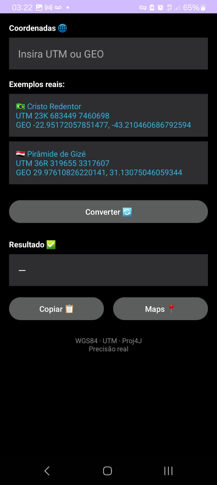
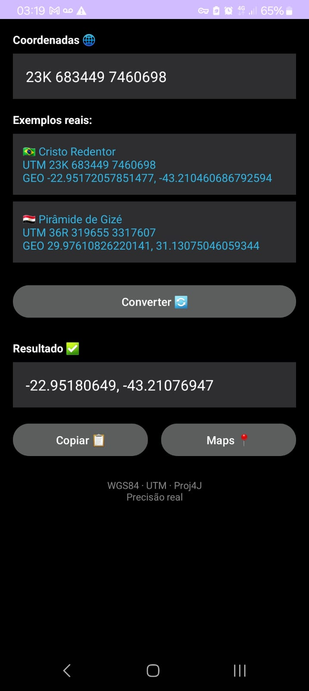

UTM Converter

Aplicativo Android leve, rápido e preciso para conversão de coordenadas geográficas entre os sistemas UTM (Universal Transverse Mercator) e Geográficas (Latitude / Longitude).

📱 Sobre o projeto

O UTM Converter foi criado para atender a uma necessidade comum em atividades de:

Geoprocessamento

Cartografia

Topografia

Engenharia

Uso em campo (GPS, mapas, imagens)

O app permite converter coordenadas UTM para Latitude/Longitude (e vice-versa) de forma simples, direta e sem dependência de serviços externos.

✨ Funcionalidades

✅ Conversão de UTM → Geográfica

✅ Conversão de Geográfica → UTM

✅ Suporte a zonas UTM

✅ Interface simples e objetiva

✅ Execução 100% local (offline)

✅ Botão rápido para abrir coordenadas no Google Maps

🛠️ Tecnologias utilizadas

Kotlin

Android SDK

Gradle (Kotlin DSL)

Proj4J (biblioteca de conversão geográfica)

📂 Estrutura do projeto

utm-converter/
├── app/
│   ├── build.gradle.kts
│   └── src/main/
│       ├── java/com/saile/utmconverter/
│       ├── res/
│       └── AndroidManifest.xml
├── gradle/wrapper/
├── scripts/
├── build.gradle.kts
├── settings.gradle.kts
├── gradlew
└── .gitignore

🚀 Como buildar o projeto
Pré-requisitos

Java JDK 17+

Android SDK configurado

Build Debug

./gradlew assembleDebug

O APK será gerado em:

app/build/outputs/apk/debug/

🔐 Build de Release (assinado)

O projeto já possui scripts auxiliares no diretório scripts/ para:

Geração de keystore

Build de APK de release

⚠️ Importante:

O arquivo .jks NÃO é versionado

Senhas NUNCA devem ser commitadas

🧪 Scripts úteis

No diretório scripts/ você encontrará utilitários como:

debug-apk.sh – gera APK de debug

release-apk.sh – gera APK de release

create-release-keystore.sh – cria keystore

dump-code-*.sh – scripts auxiliares de inspeção

Esses scripts fazem parte do workflow do projeto e ajudam na automação.

🗺️ Exemplo de uso

Entrada UTM:

Zona: 23K

Easting: 683449

Northing: 7460698

Saída Geográfica:

Latitude / Longitude

## 📸 Screenshots

  
  

📌 Roadmap

📄 Licença

Este projeto é distribuído sob a licença MIT.

Você é livre para usar, modificar e distribuir, desde que mantenha os créditos.

👤 Autor

Desenvolvido por Bruno (Bruno1991).

Se tiver sugestões ou melhorias, fique à vontade para abrir uma issue ou pull request.